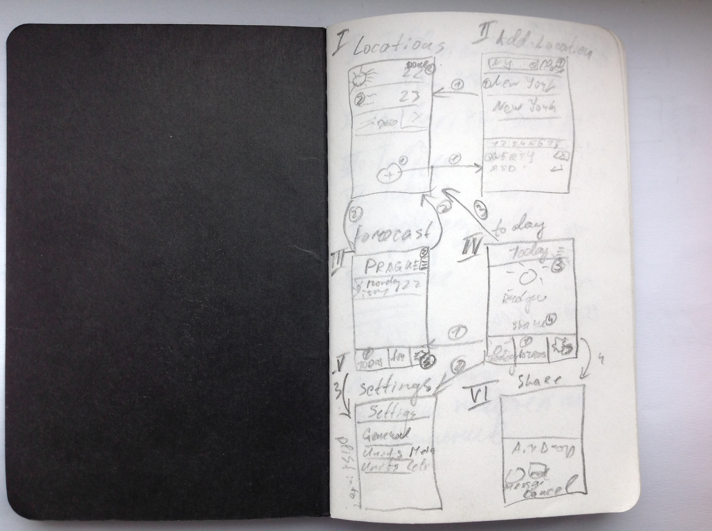

# Test Weather app

## Instructions

* Clone git repository
* Install pods
* Open workspace and run application

## Realization

Data is stored as encoded file what's constrains of its size.  
Only locations titles are stored all info is loaded at app launch time.  

Settings is stored in settings.plist file and exposed in tableView what provides ways for extensibility.   
Values of settings are also not constrained to two possibilities in sake of extensibility as well.  

Locations are storer in shared object to provide consistency across all of the screens.  

## Test asset drawbacks

### Today screen:

Line and Line@2x are actually different from Line@3x

Showing celsius icon displaying pressure 

### Location screen

`Location_Divider@3x.png` starts with small latter `Location_**d**ivider@3x`

## Screenshot

